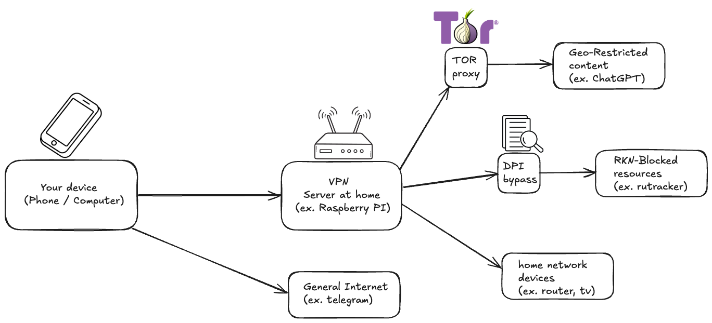

# Homelab 🖥️ 🧪

My homelab config
I run on a Raspberry PI 5

```bash
# Run with podman-compose
podman-compose build
podman-compose up -d
# Or use a script
./run.sh
```

## Services 🛠️

- AdGuard Home
- WireGuard (wg-easy)
- Tor
- Filebrowser

## Idea 💡

A smart VPN solution that intelligently routes
traffic based on destination requirements.
Devices connected to this VPN automatically get optimized
network paths for different types of web resources.

### Traffic Routing Logic 🛣️



#### 1. Local Network Access 🏠

Condition: Requests to local IP addresses (192.168.x.x)

Routing: Direct connection to home network devices

#### 2. Geo-Restricted Content 🌍

Condition: Websites blocking requests from Russia

Routing: Traffic routed through TOR Network
(Ensures anonymous access to region-locked services)

#### 3. RKN-Blocked Resources 🚫

Condition: Destinations in Russian Internet Restriction List

Routing: Advanced DPI-Bypass techniques
(Circumvents deep packet inspection for restricted content)

#### 4. General Internet Access ⚡

Condition: All other web requests

Routing: Direct connection
(Maintains optimal speeds for regular browsing)

## Other 📜

Look all this up to learn more

### Protocols

- TOR
- WireGuard
- DNS
- Socks5
- HTTP
- TCP
- UDP
- IP

### OSI model

| Уровень (layer)                 | Тип данных (PDU)                           | Примеры                                              | Для чего                                                 | Оборудование                                     |
| ------------------------------- | ------------------------------------------ | ---------------------------------------------------- | -------------------------------------------------------- | ------------------------------------------------ |
| 7. Прикладной (application)     | Данные                                     | HTTP, FTP, SMTP, WebSocket                           | Доступ к сетевым службам                                 | Хосты (клиенты сети), Firewall                   |
| 6. Представления (presentation) | Данные                                     | ASCII, SSL, gzip                                     | Представление и шифрование данных                        | Хосты (клиенты сети), Firewall                   |
| 5. Сеансовый (session)          | Данные                                     | RPC, PAP, L2TP, gRPC                                 | Управление сеансом связи                                 | Хосты (клиенты сети), Firewall                   |
| 4. Транспортный (transport)     | Сегменты (segment) / Датаграммы (datagram) | TCP, UDP, SCTP, Порты                                | Прямая связь между конечными пунктами и надёжность       | Хосты (клиенты сети), Firewall                   |
| 3. Сетевой (network)            | Пакеты (packet)                            | IPv4, IPv6, IPsec, AppleTalk, ICMP                   | Определение маршрута и логическая адресация              | Маршрутизатор, Сетевой шлюз, Firewall            |
| 2. Канальный (data link)        | Биты (bit) / Кадры (frame)                 | PPP, IEEE 802.22, Ethernet, DSL, ARP, сетевая карта. | Физическая адресация                                     | Сетевой мост, Коммутатор, точка доступа          |
| 1. Физический (physical)        | Биты (bit)                                 | USB, RJ («витая пара», оптоволоконный), радиоканал   | Работа со средой передачи, сигналами и двоичными данными | Концентратор, Повторитель (сетевое оборудование) |
